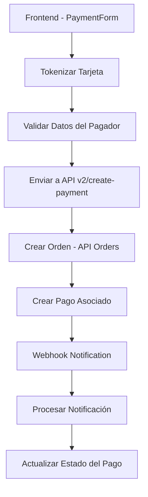

# Guía de Integración de Pagos - Mercado Pago

## Resumen

Esta guía documenta la implementación completa del sistema de pagos con Mercado Pago para el Portfolio Fotográfico, siguiendo las mejores prácticas de seguridad y validación según la lista de verificación de calidad oficial.

## Arquitectura del Sistema

### Flujo de Pago



### Componentes Principales

1. **Frontend**: `components/payment/PaymentForm.tsx`
2. **Backend API**: `app/api/payment/v2/create-payment/route.ts`
3. **Servicio de Pago**: `lib/payment/mercadopago.service.ts`
4. **Webhook Handler**: `app/api/payment/webhook/mercadopago/route.ts`

## Implementación de Requisitos de Calidad

### ✅ Campos Obligatorios Implementados

| Requisito | Campo | Estado | Implementación |
|-----------|-------|--------|----------------|
| Email del comprador | `payer.email` | ✅ | Validación de formato y presencia |
| Nombre del comprador | `payer.first_name` | ✅ | Validación de longitud mínima |
| Apellido del comprador | `payer.last_name` | ✅ | Validación de longitud mínima |
| Categoría del item | `items.category_id` | ✅ | Mapeo automático por tipo de producto |
| Descripción del item | `items.description` | ✅ | Generada automáticamente |
| Código del item | `items.id` | ✅ | ID único generado |
| Cantidad del producto | `items.quantity` | ✅ | Del carrito de compras |
| Nombre del item | `items.title` | ✅ | Del producto en Sanity |
| Precio del item | `items.unit_price` | ✅ | Calculado dinámicamente |
| Referencia externa | `external_reference` | ✅ | ID único de orden |
| Notificaciones webhooks | `notification_url` | ✅ | Configurada automáticamente |

### ✅ Buenas Prácticas Implementadas

| Práctica | Campo | Estado | Beneficio |
|----------|-------|--------|-----------|
| Identificación del comprador | `payer.identification` | ✅ | Mejora tasa de aprobación |
| Teléfono del comprador | `payer.phone` | ✅ | Validación de seguridad |
| Dirección del comprador | `payer.address` | ✅ | Prevención de fraude |
| Descripción de tarjeta | `statement_descriptor` | ✅ | Reduce contracargos |
| Device ID | Automático | ✅ | SDK de Mercado Pago |
| SSL/TLS | Configuración | ✅ | Seguridad de datos |

## Validaciones de Seguridad

### Validación de Datos del Pagador

```typescript
private validatePayerData(payer: any): void {
  const errors: string[] = [];

  // Email (requisito obligatorio)
  if (!payer.email || !this.isValidEmail(payer.email)) {
    errors.push('Email del comprador es requerido y debe ser válido');
  }

  // Nombre (requisito obligatorio)
  if (!payer.first_name || payer.first_name.trim().length < 2) {
    errors.push('Nombre del comprador es requerido (mínimo 2 caracteres)');
  }

  // Apellido (requisito obligatorio)
  if (!payer.last_name || payer.last_name.trim().length < 2) {
    errors.push('Apellido del comprador es requerido (mínimo 2 caracteres)');
  }

  // Identificación (buena práctica)
  if (payer.identification) {
    if (!payer.identification.type || !payer.identification.number) {
      errors.push('Tipo y número de identificación son requeridos');
    }
    
    // Validar formato según el tipo
    if (payer.identification.type === 'DNI' && !this.isValidDNI(payer.identification.number)) {
      errors.push('Formato de DNI inválido');
    }
    
    if (payer.identification.type === 'CPF' && !this.isValidCPF(payer.identification.number)) {
      errors.push('Formato de CPF inválido');
    }
  }

  if (errors.length > 0) {
    throw new Error(`Datos del pagador inválidos: ${errors.join(', ')}`);
  }
}
```

### Validación de Formatos

- **Email**: Regex estándar para validación de formato
- **DNI Argentino**: 7-8 dígitos numéricos
- **CPF Brasileño**: 11 dígitos con validación de dígitos verificadores
- **Montos**: Validación de montos mínimos por moneda

## Manejo de Errores

### Códigos de Error Específicos

```typescript
private getErrorCode(status: number, errorData: any): string {
  // Códigos de error específicos de Mercado Pago
  if (errorData.errors && Array.isArray(errorData.errors) && errorData.errors.length > 0) {
    const firstError = errorData.errors[0];
    if (firstError.code) {
      return `MP_${firstError.code}`;
    }
  }

  // Códigos de error HTTP estándar
  switch (status) {
    case 400: return 'HTTP_400_BAD_REQUEST';
    case 401: return 'HTTP_401_UNAUTHORIZED';
    case 402: return 'HTTP_402_PAYMENT_REQUIRED';
    case 403: return 'HTTP_403_FORBIDDEN';
    case 404: return 'HTTP_404_NOT_FOUND';
    case 422: return 'HTTP_422_UNPROCESSABLE_ENTITY';
    case 500: return 'HTTP_500_INTERNAL_SERVER_ERROR';
    case 502: return 'HTTP_502_BAD_GATEWAY';
    case 503: return 'HTTP_503_SERVICE_UNAVAILABLE';
    default: return `HTTP_${status}_UNKNOWN`;
  }
}
```

### Mensajes de Error Amigables

- **400**: "Los datos enviados no son válidos. Por favor, verifica la información e intenta nuevamente."
- **402**: "Error de procesamiento del pago. Verifica los datos de la tarjeta e intenta nuevamente."
- **500**: "Error interno del servidor. Por favor, intenta nuevamente más tarde."

## Casos de Prueba

### Flujos Críticos

1. **Pago Exitoso**
   - Validación de datos del pagador
   - Creación de orden
   - Procesamiento de pago
   - Notificación webhook

2. **Errores de Validación**
   - Datos del pagador inválidos
   - Montos insuficientes
   - Formatos incorrectos

3. **Errores de Procesamiento**
   - Tarjeta rechazada
   - Error de red
   - Timeout de API

### Archivo de Pruebas

Ver `tests/payment-flow.test.ts` para casos de prueba completos.

## Configuración de Webhooks

### URL de Webhook

```
https://cristianpirovano.com/api/payment/webhook/mercadopago?source_news=webhooks&integration_type=orders_api&version=3.0.0
```

### Eventos Configurados

- `topic_merchant_order_wh`: Notificaciones de órdenes
- `payment`: Notificaciones de pagos (compatibilidad)

### Configuración Manual del Webhook

#### 1. Acceder al Panel de Mercado Pago
- Ir a: https://www.mercadopago.com.ar/developers
- Iniciar sesión con tu cuenta de Mercado Pago
- Seleccionar tu aplicación

#### 2. Configurar Webhook
- Ir a la sección "Notificaciones webhooks"
- Hacer clic en "Configurar notificaciones"
- Ingresar la URL del webhook: `https://cristianpirovano.com/api/payment/webhook/mercadopago`

#### 3. Seleccionar Eventos
- Marcar "Pagos" (payment)
- Marcar "Órdenes comerciales" (topic_merchant_order_wh)
- Guardar configuración

#### 4. Verificar Configuración
- El webhook debe aparecer como "Activo"
- Verificar que la URL sea correcta
- Probar con una transacción de prueba

### Script de Configuración

Ejecutar el script de configuración:

```bash
node scripts/configure-webhook-production.js
```

Este script proporciona instrucciones detalladas y prueba la conectividad del webhook.

## Monitoreo y Logging

### Logs Estructurados

```typescript
console.log('💳 Procesando pago con API Orders v2:', {
  region: region.country,
  currency: region.currency,
  amount: paymentData.transaction_amount,
  installments: paymentData.installments,
  provider: region.paymentProvider
});
```

### Métricas de Calidad

- Tasa de aprobación de pagos
- Tiempo de respuesta de API
- Errores por tipo de error
- Volumen de transacciones

## Seguridad

### Validaciones Implementadas

1. **Validación de entrada**: Todos los datos son validados antes del envío
2. **Sanitización**: Datos sensibles son sanitizados
3. **Autenticación**: Tokens de acceso seguros
4. **HTTPS**: Comunicación encriptada
5. **PCI Compliance**: No almacenamiento de datos de tarjeta

### Mejores Prácticas

- Uso del SDK oficial de Mercado Pago
- Validación en frontend y backend
- Logging de errores sin datos sensibles
- Manejo seguro de excepciones

## Troubleshooting

### Errores Comunes

1. **Error 402 - Payment Required**
   - Verificar datos de la tarjeta
   - Validar monto mínimo
   - Revisar configuración de API

2. **Error 400 - Bad Request**
   - Validar estructura del payload
   - Verificar campos obligatorios
   - Revisar formatos de datos

3. **Error 500 - Internal Server Error**
   - Verificar credenciales de API
   - Revisar logs del servidor
   - Contactar soporte de Mercado Pago

### Logs de Debugging

```bash
# Verificar logs de pago
grep "💳 Procesando pago" logs/app.log

# Verificar errores
grep "❌ Error" logs/app.log

# Verificar webhooks
grep "webhook" logs/app.log
```

## Mantenimiento

### Actualizaciones Regulares

1. **SDK de Mercado Pago**: Mantener actualizado
2. **Validaciones**: Revisar nuevas reglas de validación
3. **Monitoreo**: Revisar métricas de calidad
4. **Logs**: Limpiar logs antiguos

### Backup y Recuperación

- Backup de configuración de webhooks
- Backup de logs de transacciones
- Plan de recuperación ante fallos

## Contacto y Soporte

- **Documentación**: [Mercado Pago Developers](https://www.mercadopago.com.ar/developers)
- **Soporte Técnico**: [Soporte Mercado Pago](https://www.mercadopago.com.ar/ayuda)
- **Estado del Servicio**: [Status Mercado Pago](https://status.mercadopago.com/)

---

**Última actualización**: 29 de Octubre de 2025
**Versión**: 1.0.0  
**Autor**: Portfolio Fotográfico Team
